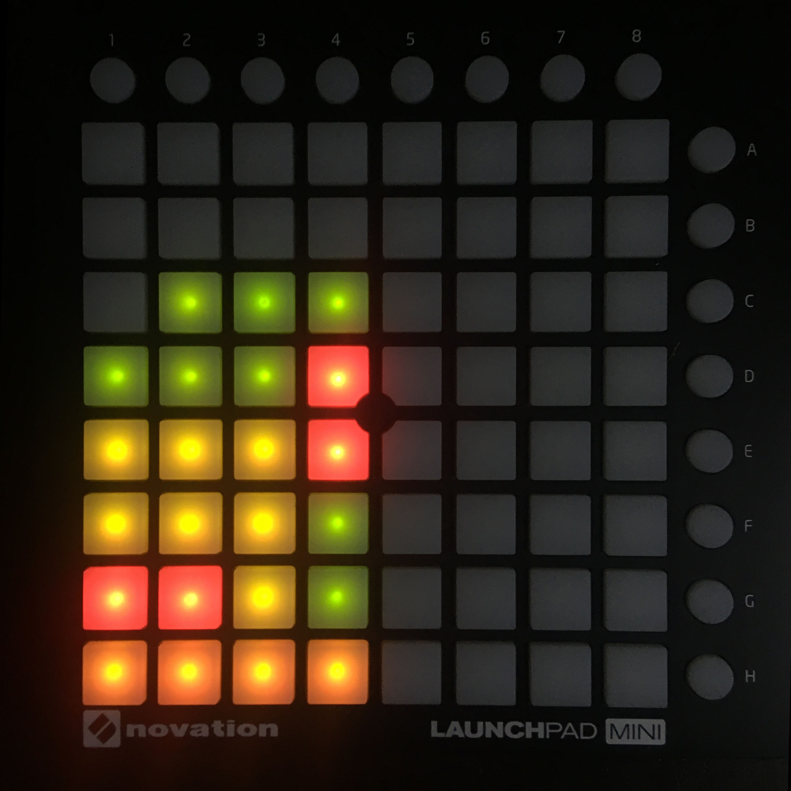
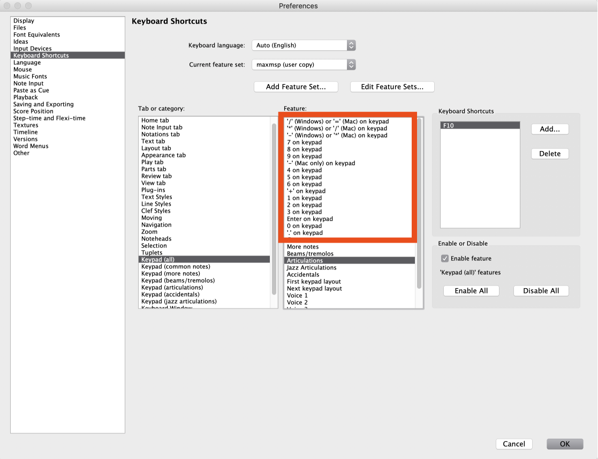
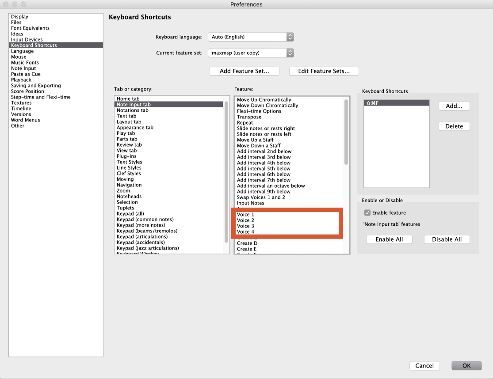

# Launchpad => Sibelius

## by Lewis Wolf

Depedencies: [aka.keyboard](http://akamatsu.org/aka/max/objects/)

Are you one of those muso's who uses both Ableton and Sibelius? Well then, you should make your life easier with this lil patch.

## Installation

To use this patch, simply go through the shortcuts shown below and press all buttons. Do this once and it'll work everytime.

